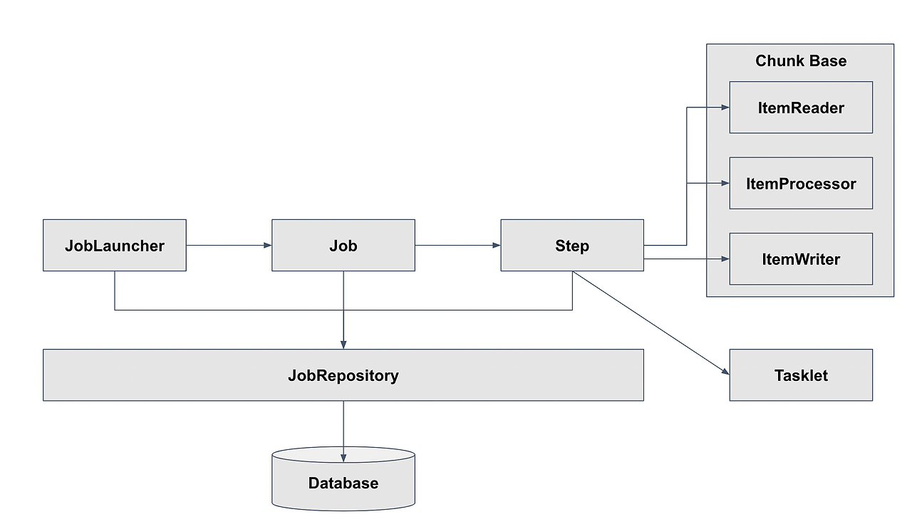

# Spring Batch
## 프로젝트 정보
- [패스트캠퍼스] 실무를 위한 Spring Batch의 모든 것

## 프로젝트 설정
- Docker
  - docker-compose up -d
- 테이블 생성
  - scheme.sql

## 개념정리
### Spring Batch 특징 및 장점
- 풍부한 필수 기능 제공
  - 트랜잭션 관리, 로깅/추적, 체크포인트/재시작, 통계 집계, 예외 처리(Skip), 재시도(Retry) 등의 기능을 간편히 활용 가능
  - 실패한 배치 Job을 중단 지점부터 재시작하거나 동일 파라미터로 중복 실행 방지 지원
- Spring 생태계와 쉬운 통합
  - Spring Framework 기반으로 DI, AOP 활용 가능
  - Spring Boot 환경에서 Starter 의존성 추가만으로 자동 설정(DataSource, JobRepository 등) 제공
  - Spring Integration, Spring Cloud(Data Flow, Task)와 연계하여 배치 파이프라인 확장 및 모니터링 가능
- 검증된 성능과 안정성
  - 금융권, 이커머스 등 다양한 산업에서 검증된 신뢰성과 성능 제공
  - 청크 기반 처리, 멀티스레딩, 파티셔닝을 통한 효율적인 대용량 데이터 처리 지원
  - 청크 크기, 스레드 개수 등 세부적인 성능 튜닝 가능
- 다양한 Reader/Writer 지원
  - 파일(CSV, XML, JSON), DB(JDBC, JPA), JMS, MongoDB 등의 다양한 데이터 소스를 기본적으로 지원
  - 커스텀 ItemReader/Writer로 새로운 데이터 소스에 쉽게 대응 가능

### Spring Batch 구조
- 구조
  - 
    - JobLauncher
      - 배치 잡(Job)을 실행하는 진입점
    - Job
      - 하나의 배치 작업 단위
      - 내부에 여러 개의 Step으로 구성
    - Step
      - Chunk 기반 처리나 Tasklet 단위로 비즈니스 로직을 수행
    - JobRepository
      - 배치 메타데이터(실행 기록, 파라미터, 상태 등)를 저장 및 조회하는 저장소
    - Database
      - 배치 메타데이터 테이블이 생성·관리되는 물리적 저장소
    - Tasklet
      - Step 내에서 단일 작업 단위를 수행하는 컴포넌트
    - Chunk Base
      - 데이터를 처리하는 묶음의 크기
    - ItemReader
      - 처리 대상을 읽어오는 단계
    - ItemProcessor
      - 읽어온 아이템을 가공·변환·검증하는 단계
    - ItemWriter
      - 가공된 아이템을 저장하거나 전송

### Job
- Job은 Spring Batch에서 배치 처리의 최상위 단위이다.
- Spring Batch에서 Job은 구성(configuration)과 실행(execution) 두 역할을 동시에 수행한다.
  - Job은 어떤 Step들을 어떤 순서로 실행할지 정의한다.
  - Job은 JobLauncher에 의해 실행되며, 실행 시 전달된 JobParameters를 기반으로 고유한 JobInstance를 생성한다.
  - 이 실행은 JobExecution이라는 실행 이력으로 기록되며, 추적 및 재시작이 가능하다.

### JobInstance
- 특정 Job이 특정 파라미터로 실행된 논리적 인스턴스
- 같은 Job이라도, 실행 파라미터가 다르면 새로운 JobInstance로 간주
  - 즉, Job명 + JobParameters 조합으로 유일하다.
  - 같은 JobName, 같은 JobParameters면 이미 존재하는 JobInstance → 중복 실행 방지

### JobParameters
- Job 실행 시 입력되는 파라미터 집합
- JobInstance의 유일성을 결정짓는 핵심 요소

### JobParameters와 JobInstance의 관계
- JobName + JobParameters의 조합이 기존에 존재하면, 동일 JobInstance로 인식
- 파라미터가 하나라도 다르면 새로운 JobInstance 생성

### JobExecution
- JobInstance의 한 번의 실제 실행 이력
- 하나의 JobInstance(특정 JobName+JobParameters)에 대해 여러 번 실행(재시작, 실패 후 재시도 등)이 있을 수 있음
- 실행마다 별도의 JobExecution이 생성되고, 각각 status(성공/실패), 시작/종료 시각, 에러메시지, 종료코드 등이 저장